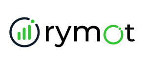

# Rymot

  

  Workforce Intelligence Infrastructure for Modern Organizations

---

## Overview

Rymot builds workforce intelligence software that helps organizations understand how work happens across teams, devices, and workflows.

By combining activity intelligence, productivity analytics, operational visibility, and security-focused telemetry, Rymot transforms workplace activity into actionable insight.

Our mission is simple:

**Help organizations improve productivity, visibility, and operational clarity without sacrificing performance, transparency, or user experience.**

---

## Product Ecosystem

### Rymot Workforce

Workforce intelligence platform for modern organizations.

Designed to provide operational visibility, activity intelligence, productivity analytics, reporting, and workforce insights across distributed teams.

### Rymot Enterprise

Advanced monitoring, compliance, and security platform.

Built for organizations that require investigative visibility, risk monitoring, auditing, compliance workflows, and enterprise-scale workforce intelligence.

### Rymot Local

Personal cognitive intelligence for modern knowledge work.

A local-first desktop experience designed for developers, students, freelancers, and knowledge workers who want to better understand how they work without sending their data to the cloud.

---

## Platform Capabilities

* Workforce Intelligence
* Productivity Analytics
* Operational Visibility
* Activity Intelligence
* Reporting & Insights
* Security & Compliance

---

## Technology

Built with modern systems technologies including Rust, Tauri, TypeScript, PostgreSQL, and SQLite.

Designed for high-performance telemetry, workforce intelligence, and cross-platform deployment.

---

## Vision

We believe organizations should be able to understand how work happens without sacrificing transparency, usability, or performance.

Our long-term goal is to build the operating system for workforce intelligence:

* Enterprise-scale performance
* Modern user experience
* Flexible deployment models
* Security and compliance readiness
* Actionable organizational intelligence

---

## Resources

**Website**
https://rymot.io

**Support**
[support@rymot.io](mailto:support@rymot.io)

**Security Reports**
[security@rymot.io](mailto:security@rymot.io)

**GitHub Organization**
https://github.com/rymot-hq

---

  Building the future of workforce intelligence.

